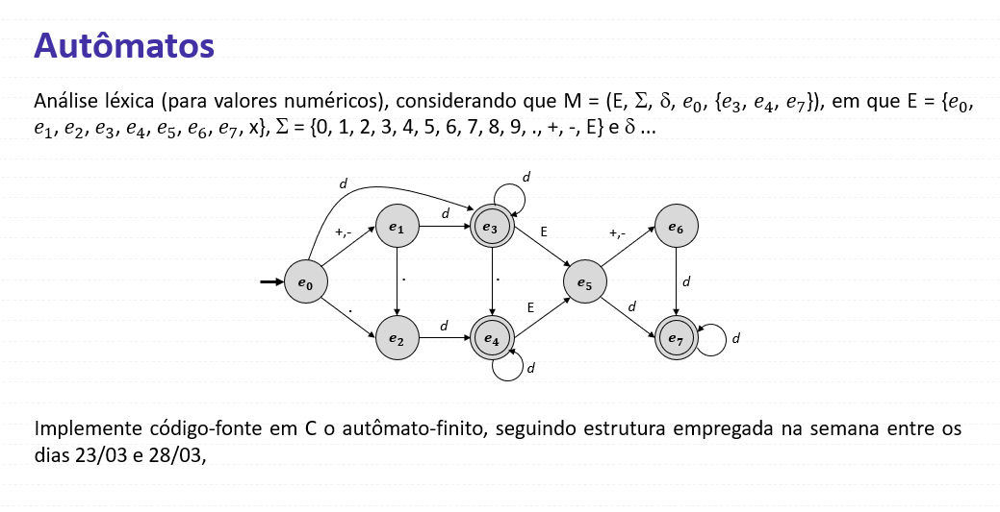

# 📘 Autômato Finito para Análise Léxica de Números

## 🧾 Exercício



---

## 🎯 Objetivo

Implementar, em linguagem C, um **autômato finito determinístico (AFD)** capaz de reconhecer valores numéricos válidos, incluindo:

- Números inteiros → `12`
- Números com sinal → `-5`, `+10`
- Números decimais → `3.14`
- Notação científica → `1.2E10`, `2e-3`

---

## 🧠 Ideia Geral

O programa lê uma string digitada pelo usuário e percorre **caractere por caractere**, mudando de estado conforme o autômato.

- Se terminar em um estado final → `ACEITA`
- Caso contrário → `REJEITA`

---

## ⚙️ Como rodar o projeto

### 1. Compilar
```bash
gcc q01.c
```

### 2. Executar
```bash
./a.out
```

### 3. Testar

Digite no terminal:
```bash
12
```

Pressione Enter.

---

## 🛑 Encerramento do Programa

O programa permanece em execução contínua, aguardando entradas do usuário via terminal. Para encerrá-lo, utilize:

- `Ctrl + C` para interrupção manual  
- Ou finalize o terminal em execução  

---

## 📌 Exemplo de execução

```bash
12
ACEITA
```

```bash
1.2E10
ACEITA
```

```bash
abc
REJEITA
```

---

## 🧾 Explicação do Código

### 🔹 Estados do autômato

```c
typedef enum { E0, E1, E2, E3, E4, E5, E6, E7, DEAD} State;
```

- `E0` → estado inicial  
- `E3`, `E4`, `E7` → estados finais (aceitação)  
- `DEAD` → estado de erro  

---

### 🔹 Função `step`

Responsável por fazer a **transição de estados**:

```c
static State step(State s, char x)
```

Recebe:
- `s` → estado atual  
- `x` → caractere lido  

Retorna:
- próximo estado

---

### 🔹 Exemplo de transição

```c
case E0:
    if (!is_not_digit_1_9(x)) return E3;
```

Se estiver no estado inicial e ler um número, vai para `E3`.

---

### 🔹 Função de validação de dígito

```c
int is_not_digit_1_9 (char c)
```

Retorna:
- `1` → NÃO é número  
- `0` → é número  

---

### 🔹 Loop principal

```c
while (fgets(buf, sizeof buf, stdin))
```

- Lê entrada do usuário  
- Processa caractere por caractere  

---

### 🔹 Validação de caracteres

```c
if (is_not_digit_1_9(ch) && ch != '.' && ch != '+' && ch != '-' && ch != 'E' && ch != 'e')
```

Garante que apenas caracteres válidos sejam aceitos.

---

### 🔹 Verificação final

```c
if (ok && (e0 == E3 || e0 == E4 || e0 == E7))
```

Só aceita se terminar em estado válido.

---

## 🧠 Conclusão

Esse projeto demonstra:

- Implementação prática de **autômatos finitos**
- Simulação de **análise léxica**
- Uso de **C para processamento de strings**
